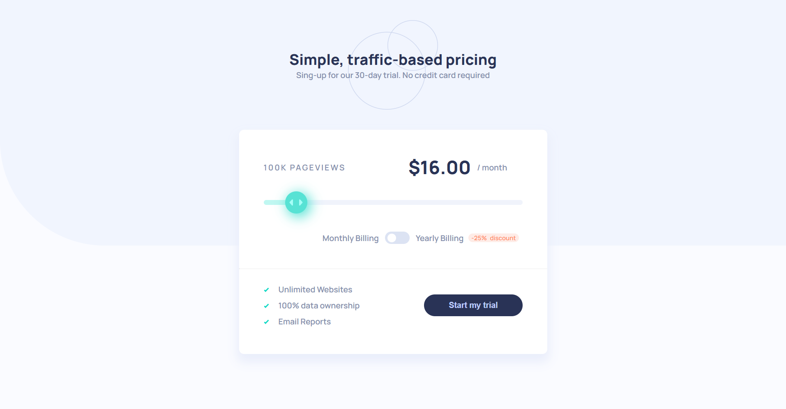

# Frontend Mentor - Interactive pricing component solution

This is a solution to the [Interactive pricing component challenge on Frontend Mentor](https://www.frontendmentor.io/challenges/interactive-pricing-component-t0m8PIyY8). Frontend Mentor challenges help you improve your coding skills by building realistic projects.

## Table of contents

- [Overview](#overview)
  - [The challenge](#the-challenge)
  - [Screenshot](#screenshot)
  - [Links](#links)
- [My process](#my-process)
  - [Built with](#built-with)
  - [What I learned](#what-i-learned)
  - [Continued development](#continued-development)
  - [Useful resources](#useful-resources)
- [Author](#author)
- [Acknowledgments](#acknowledgments)

**Note: Delete this note and update the table of contents based on what sections you keep.**

## Overview

### The challenge

Users should be able to:

- View the optimal layout for the app depending on their device's screen size
- See hover states for all interactive elements on the page
- Use the slider and toggle to see prices for different page view numbers

### Screenshot



### Links

- Solution URL: [https://github.com/AIY7788/interactive-pricing-component-ts](https://github.com/AIY7788/interactive-pricing-component-ts)
- Live Site URL: [https://aiy7788.github.io/interactive-pricing-component-ts/](https://aiy7788.github.io/interactive-pricing-component-ts/)

## My process

### Built with

- Semantic HTML5 markup
- CSS custom properties
- Flexbox
- CSS Grid
- Mobile-first workflow
- TypeScript
- [React](https://reactjs.org/) - JS library
- [Vite](https://vite.dev/) - A build tool

### What I learned

I learned how to create the range bar.

```html
<div className="range-section">
  <input style={{ background: `linear-gradient(90deg, var(--cyan-soft)
  ${valuePercentage}%, var(--blue-light-slider) ${valuePercentage}%)`, }}
  onChange={handleOnChang} type="range" className="slice-range" min={MIN}
  max={MAX} value={valueRange} />
</div>
```

```css
.slice-range {
  -webkit-appearance: none;
  appearance: none;
  width: 100%;
  height: 8px;
  border-radius: 5px;
  outline: none;
  opacity: 0.7;
  -webkit-transition: 0.2s;
  transition: opacity 0.2s;
}

.slice-range:active {
  opacity: 1;
}

.slice-range::-webkit-slider-thumb {
  -webkit-appearance: none;
  appearance: none;
  width: 36px;
  height: 36px;
  background: url("/images/icon-slider.svg") no-repeat center;
  background-color: var(--cyan-strong);
  border-radius: 50%;
  box-shadow: 4px 4px 20px 2px var(--cyan-strong);
  cursor: pointer;
}

.slice-range::-webkit-slider-thumb:active {
  cursor: grabbing;
}

.slice-range::-moz-range-thumb {
  width: 36px;
  height: 36px;
  background: url("/images/icon-slider.svg") no-repeat center;
  background-color: var(--cyan-strong);
  border-radius: 50%;
  box-shadow: 6px 6px 40px hsla(var(--cyan-strong), 0.1), -6px -6px 40px hsla(var(--cyan-strong), 0.1);
  cursor: pointer;
}

.slice-range::-moz-range-thumb:active {
  cursor: grabbing;
}
```

### Useful resources

- [w3schools](https://www.w3schools.com/)

## Author

- Frontend Mentor - [@yourusername](https://www.frontendmentor.io/profile/AIY7788)
